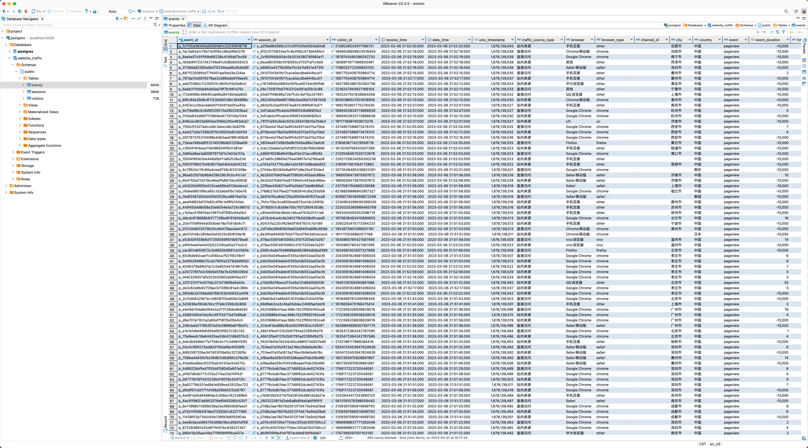
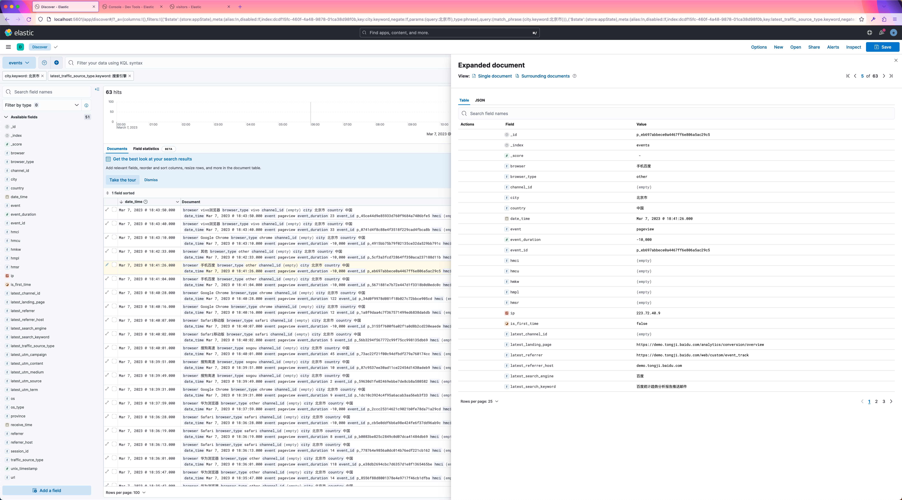

# python-baidu-tongji

A modern-style implementation of Baidu Analytics (Tongji) in Python programming language.


## 功能简介

利用百度统计API，获取网站实时访客数据，解析并构建 Visitor 、Session 、Event 三个对象，方便后续数据分析。

### 亮点功能

- Token 生成、自动刷新
- 更精确的访客区域信息（国家、省份、城市）
- 更精细的流量来源划分，包括站内来源等
- 一级路径、完整路径、参数拆分，支持子目录分析
- utm / hm 参数解析，支持指定广告跟踪
- 支持跨会话的访客访问轨迹细查
- 支持访客来源归因


## 软件要求

- SQLite
- Redis
- MongoDB (可选，用于存储过程数据)
- PostgreSQL (可选，用于 Demo)
- Elasticsearch、Kibana (可选，用于 Demo)


## 使用方法

0. 使用**普通**百度账号开通百度统计数据API，获得 `API Key` 和 `Secret Key`。
1. 按照[文档说明](https://tongji.baidu.com/api/manual/Chapter2/openapi.html)获得`CODE`（一次性授权码）。
2. 将 `API Key`, `Secret Key`, `CODE` 填入 `package/config.yaml` 中。
3. 安装依赖 `python3 -m pip install -r requirements.txt`。
4. 调用 `package/baidu_tongji.py` 即可。


## Demo 介绍

### PostgreSQL

使用 `baidu_tongji.py` 获取的数据，并存储到 PostgreSQL 数据库中。

0. 创建一个名为 `website_traffic` 的数据库。
    ```SQL
    CREATE DATABASE website_traffic;
    COMMENT ON DATABASE website_traffic IS '网站流量';
    ```
1. 执行 `DDL/DDL_website_traffic.sql` 创建表结构。
2. 修改 `main.py` 中的数据库信息，运行即可。



### Elasticsearch

使用 `baidu_tongji.py` 获取的数据，并存储到 Elasticsearch 中。

0. 修改 `main.py` 中的账号密码，运行即可。（首次运行，建议先创建索引，详见代码注释。）




## 参考资料
- [百度统计 Tongji API 用户手册](https://tongji.baidu.com/api/manual/)
- [百度统计产品使用指南](https://tongji.baidu.com/holmes/Analytics/%E4%BA%A7%E5%93%81%E4%BD%BF%E7%94%A8%E6%8C%87%E5%8D%97/%E6%A6%82%E8%A7%88/%E6%B5%81%E9%87%8F%E5%88%86%E6%9E%90/%E5%AE%9E%E6%97%B6%E8%AE%BF%E5%AE%A2/)
- [神策分析帮助文档](https://manual.sensorsdata.cn/sa/latest/tech_sdk_all_preset_properties-89620676.html)


## TODO
- [ ] 实现基于访客数据的常用指标


## Thanks
[GitHub Copilot](https://github.com/features/copilot), [vscode-chatgpt](https://github.com/gencay/vscode-chatgpt), [Administrative-divisions-of-China](https://github.com/modood/Administrative-divisions-of-China)
