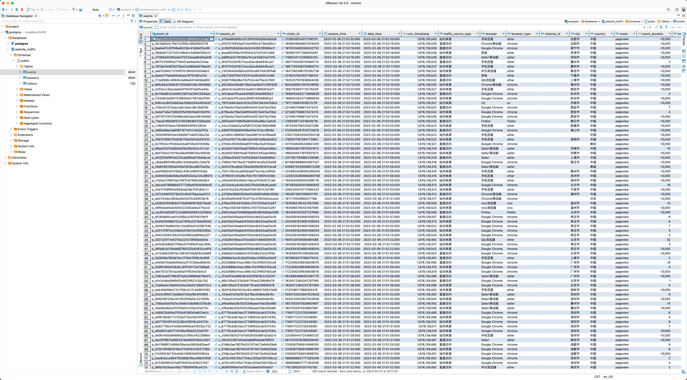
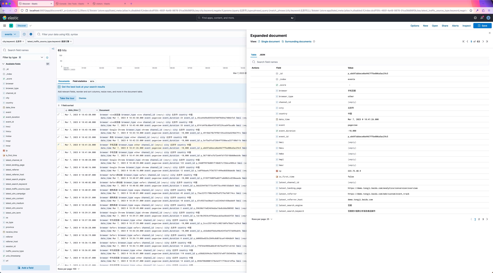

# python-baidu-tongji

A modern-style implementation of Baidu Analytics (Tongji) in Python.

利用百度统计API，获取网站实时访客数据，解析并构建 Visitor 、Session 、Event 三个对象，以便后续数据汇总分析。

---

### ✨ 亮点功能

- 百度统计 API Token 生成、自动刷新
- 更精确的访客区域信息，包含国家、省份、城市三个字段（百度统计仅提供城市简称）
- 更精细的流量渠道渠道划分，包括社交媒体、站内来源等（百度统计没有“社交媒体”分类；免费版已下架“站内来源”功能）
- 支持 referrer 域名解析、支持页面路径/参数解析，方便聚类分析，如实现子目录分析、指定广告跟踪功能（免费版已下线“子目录分析”、“指定广告跟踪”功能）
- 支持访客来源归因、轨迹分析，及高频IP与地域信息统计


- 🤔 **Before**：[原始返回数据 raw_data.json](./tests/16847648_raw_data.json)
- 🤩 **After**： [解析后的数据 result_data.json](./tests/16847648_result_data.json)


## 🧩 软件要求

- SQLite
- Redis
- MongoDB （可选，用于存储过程数据）
- PostgreSQL （可选，用于 Demo）
- Elasticsearch、Kibana （可选，用于 Demo）


## 🏁 准备工作

1. 使用**一般**百度账号（非商业账号）开通数据API，获得 `API Key` 和 `Secret Key` （参见 [百度统计 API 用户手册](https://tongji.baidu.com/api/manual/)）。
2. 按照文档步骤说明，获得一次性授权码 `CODE` （有效期为 10 分钟，过期后需要重新授权获取）。

    ```Bash
    # CLIENT_ID = API Key
    http://openapi.baidu.com/oauth/2.0/authorize?response_type=code&client_id={CLIENT_ID}&redirect_uri=oob&scope=basic&display=popup
    ```


## 📦 安装使用

1. 克隆本仓库。

   ```Bash
    git clone https://github.com/caspartse/python-baidu-tongji.git
    ```

2. 安装依赖。

   ```Bash
    cd python-baidu-tongji && \
    python3 -m pip install -r ./requirements.txt
   ```

3. 将 `API Key`, `Secret Key`, `CODE` 填入 `package/config.yaml` 中。

    ```YAML
    # Baidu openapi, https://tongji.baidu.com/api/manual/Chapter2/openapi.html
    baidu:
      api_key: your_api_key
      secret_key: your_secret_key
      auth_code: your_auth_code
    ```

4. 根据实际情况，修改 `package/config.yaml` 中的数据库配置，如 Redis：

    ```YAML
    # Redis
    redis:
      host: localhost
      port: 6379
      db: 0
      password: ''
    ```

5. 根据实际需要，修改 `package/dimensions.yaml` 中的维度配置，如 `custom_tracking_params` （自定义跟踪参数）, `onsite_search_params` （站内搜索参数）：

    ```YAML
    # Custom tracking parameters
    custom_tracking_params:
      - activity_id
      - channel_id

    # On-Site search parameters
    onsite_search_params:
      - kw
      - keyword
    ```

6. 调用 `package/baidu_tongji.py` 即可。示例可参考 `tests/test.py` 及 Demo 中的 `main.py`。
   每次调用后，原始数据会被临时存储到 `package/data` 目录下，文件名为 `{site_id}_raw_data.json` 。


## 🐣 Demo 介绍

### PostgreSQL

使用 `baidu_tongji.py` 获取的数据，并存储到 PostgreSQL 数据库中。

1. 创建一个名为 `website_traffic` 的数据库。

    ```SQL
    CREATE DATABASE website_traffic;
    COMMENT ON DATABASE website_traffic IS '网站流量';
    ```

2. 执行 `DDL/DDL_website_traffic.sql` 创建表结构。
3. 运行 `python3 main.py` 即可。



### Elasticsearch

使用 `baidu_tongji.py` 获取的数据，并存储到 Elasticsearch 中。

1. 利用 `mappings` 目录下的 json 文件，分别创建索引 `visitors`, `sessions`, `events` 索引，也可直接运行 `mappings/create_indices.py` 创建。
2. 运行 `python3 main.py` 即可。




## 📚 参考资料

- [百度统计 API 用户手册 - 实时访客](https://tongji.baidu.com/api/manual/Chapter1/trend_latest_a.html)
- [百度统计使用手册 - 实时访客](https://tongji.baidu.com/holmes/Analytics/%E4%BA%A7%E5%93%81%E4%BD%BF%E7%94%A8%E6%8C%87%E5%8D%97/%E6%A6%82%E8%A7%88/%E6%B5%81%E9%87%8F%E5%88%86%E6%9E%90/%E5%AE%9E%E6%97%B6%E8%AE%BF%E5%AE%A2/)
- [神策分析 - 预置事件与预置属性](https://manual.sensorsdata.cn/sa/latest/tech_sdk_all_preset_properties-89620676.html)
- [GA4 - Automatically collected events](https://support.google.com/analytics/answer/9234069?hl=en&ref_topic=13367566)
- [GA4 - Default channel group](https://support.google.com/analytics/answer/9756891?hl=en&ref_topic=11151952)


## 📝 TODO

- [ ] 实现基于访客数据的常用指标


## ❤️ Thanks
[GitHub Copilot](https://github.com/features/copilot), [vscode-chatgpt](https://github.com/gencay/vscode-chatgpt), [Administrative-divisions-of-China](https://github.com/modood/Administrative-divisions-of-China)
